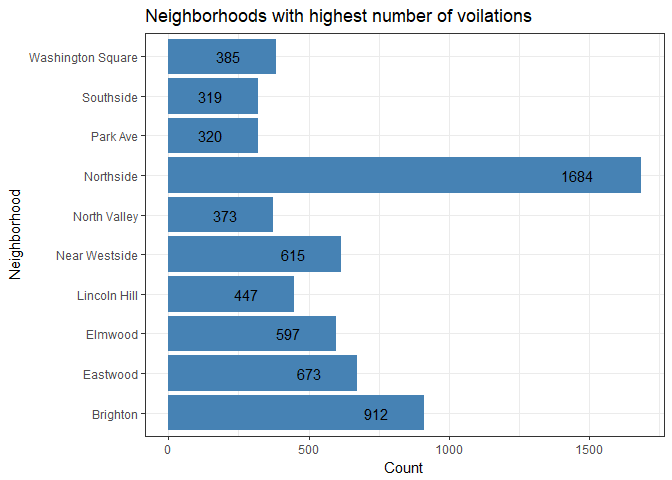
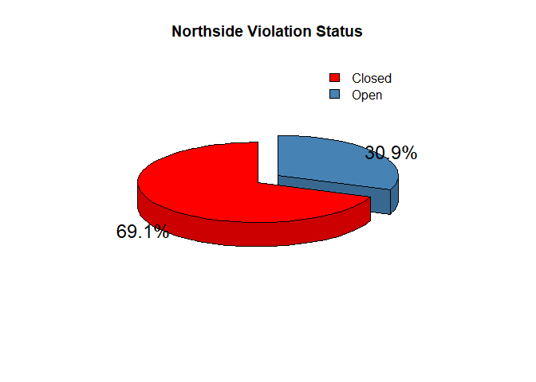

Rmarkdown Practice
================
Shashank Jain
July 17, 2018

#### This is a sample Rmarkdown file. I have used a dataset from on criminal violations and here is the analysis.

Load all the necesary library to execute your code

Summary
=======

``` r
summary(violations)
```

    ##       ï..X              Y         property_address   property_zip      
    ##  Min.   :-76.20   Min.   :42.99   Length:9206        Length:9206       
    ##  1st Qu.:-76.16   1st Qu.:43.03   Class :character   Class :character  
    ##  Median :-76.15   Median :43.05   Mode  :character   Mode  :character  
    ##  Mean   :-76.15   Mean   :43.04                                        
    ##  3rd Qu.:-76.14   3rd Qu.:43.06                                        
    ##  Max.   :-76.08   Max.   :43.08                                        
    ##  property_id        violation_name     violation_date    
    ##  Length:9206        Length:9206        Length:9206       
    ##  Class :character   Class :character   Class :character  
    ##  Mode  :character   Mode  :character   Mode  :character  
    ##                                                          
    ##                                                          
    ##                                                          
    ##  comply_by_date     violation_status   case_number       
    ##  Length:9206        Length:9206        Length:9206       
    ##  Class :character   Class :character   Class :character  
    ##  Mode  :character   Mode  :character   Mode  :character  
    ##                                                          
    ##                                                          
    ##                                                          
    ##   case_type         case_open_date     property_owner_name  inspector_id
    ##  Length:9206        Length:9206        Length:9206         Min.   :  0  
    ##  Class :character   Class :character   Class :character    1st Qu.:252  
    ##  Mode  :character   Mode  :character   Mode  :character    Median :260  
    ##                                                            Mean   :326  
    ##                                                            3rd Qu.:413  
    ##                                                            Max.   :646  
    ##  property_neighborhood vacant_property    owner_address     
    ##  Length:9206           Length:9206        Length:9206       
    ##  Class :character      Class :character   Class :character  
    ##  Mode  :character      Mode  :character   Mode  :character  
    ##                                                             
    ##                                                             
    ##                                                             
    ##   owner_city        owner_state         owner_zip              long       
    ##  Length:9206        Length:9206        Length:9206        Min.   :-76.20  
    ##  Class :character   Class :character   Class :character   1st Qu.:-76.16  
    ##  Mode  :character   Mode  :character   Mode  :character   Median :-76.15  
    ##                                                           Mean   :-76.15  
    ##                                                           3rd Qu.:-76.14  
    ##                                                           Max.   :-76.08  
    ##       lat          TNT_NAME              FID      
    ##  Min.   :42.99   Length:9206        Min.   :   1  
    ##  1st Qu.:43.03   Class :character   1st Qu.:2302  
    ##  Median :43.05   Mode  :character   Median :4604  
    ##  Mean   :43.04                      Mean   :4604  
    ##  3rd Qu.:43.06                      3rd Qu.:6905  
    ##  Max.   :43.08                      Max.   :9206

Plots
=====

``` r
neighboorhood  <- aggregate(rep(1, length(violations$property_neighborhood)),
                             by=list(violations$property_neighborhood), sum)
as.data.frame(neighboorhood)
```

    ##                    Group.1    x
    ## 1                             8
    ## 2                 Brighton  912
    ## 3           Court-Woodlawn  200
    ## 4                 Downtown   38
    ## 5                 Eastwood  673
    ## 6                  Elmwood  597
    ## 7             Far Westside  262
    ## 8             Hawley Green  107
    ## 9                Lakefront    9
    ## 10            Lincoln Hill  447
    ## 11             Meadowbrook   46
    ## 12           Near Eastside  157
    ## 13           Near Westside  615
    ## 14            North Valley  373
    ## 15               Northside 1684
    ## 16          Outer Comstock  113
    ## 17                Park Ave  320
    ## 18           Prospect Hill  112
    ## 19            Salt Springs  281
    ## 20                Sedgwick   87
    ## 21              Skunk City  257
    ## 22            South Campus    1
    ## 23            South Valley  150
    ## 24               Southside  319
    ## 25               Southwest  291
    ## 26              Strathmore  237
    ## 27               Tipp Hill  175
    ## 28         University Hill   83
    ## 29 University Neighborhood   72
    ## 30       Washington Square  385
    ## 31                Westcott  180
    ## 32               Winkworth   15

``` r
neighboorhood <- neighboorhood[neighboorhood$x >= 300,]

ggplot(data = neighboorhood,aes(x=neighboorhood$Group.1,y=neighboorhood$x))+
  geom_bar(stat = "identity",fill="steelblue") +
  xlab("Neighborhood")+
  ylab("Count")+
  ggtitle("Neighborhoods with highest number of voilations") +
  geom_text(aes(label=x), position=position_dodge(width=.9), hjust=2.5)+
  coord_flip() + theme_bw()
```



``` r
northside <- violations[violations$property_neighborhood=="Northside",]

z <- northside %>% 
  group_by(northside$violation_status) %>% 
  summarise(count=n())
```

    ## Warning: package 'bindrcpp' was built under R version 3.4.4

``` r
z <- z[1:2,]
z
```

    ## # A tibble: 2 x 2
    ##   `northside$violation_status` count
    ##   <chr>                        <int>
    ## 1 Closed                        1163
    ## 2 Open                           520

``` r
z$prop<- paste(round((z$count / sum(z$count) * 100),1), "%", sep="")

slices<- z$count
labels <- z$count
plotrix::pie3D(slices,
               labels = z$prop,
               explode=0.1,
               col=c("red", "steelblue"),
              start= pi/2, main = "Northside Violation Status")
legend("topright", legend=c("Closed", "Open"),
       fill=c("red", "steelblue"),
              bty="n")
```


